FBA4PSP is the PSP port of FinalBurn Alpha. It was created by OopsWare and Lbicelyne, and most recently improved by Reprep in 2017.

# Getting started

## Builds

FBA4PSP comes in several different builds, each optimised for a specific set of arcade games. Generally the smaller builds will have better support for the games they include.

In total, there is support for 1755 games (including clones).

| Build                                                                 | Version | Romset | Supported Games                        |
|-----------------------------------------------------------------------|---------|--------|----------------------------------------|
| [All](https://archive.org/details/fba-4-psp.-7z)                      | 12.5.4  | 0.130  | 1708 ([list](docs/gamelists/All.txt))  |
| [Cave](https://archive.org/details/cave.7z)                           | 12.5.4  | 0.130  | 27 ([list](docs/gamelists/Cave.txt))   |
| [CPS3](https://archive.org/details/cps3.7z)                           | 12.4.0  | 0.130  | 434 ([list](docs/gamelists/CPS3.txt))  |
| [LB](https://archive.org/details/fba.-7z)                             | ?       | 0.141  | 55 ([list](docs/gamelists/LB.txt))     |
| [Mid](https://archive.org/details/mid.7z)                             | 12.4.0  | 0.130  | 741 ([list](docs/gamelists/Mid.txt))   |
| [PGM](https://archive.org/details/pgm.7z)                             | 12.4.0  | 0.130  | 36 ([list](docs/gamelists/PGM.txt))    |
| [Psikyo](https://archive.org/details/fba-4-psp-psikyocorenocache.-7z) | 12.5.4  | 0.130  | 13 ([list](docs/gamelists/Psikyo.txt)) |
| [Sega](https://archive.org/details/sega.7z)                           | 12.4.0  | 0.130  | 222 ([list](docs/gamelists/Sega.txt))  |
| [Small](https://archive.org/details/small.7z)                         | 12.4.0  | 0.130  | 678 ([list](docs/gamelists/Small.txt)) |

[Full list of supported games](docs/gamelists/full-gamelist.md)

Some 'supported' games do not actually work. When that happens, you can try to launch the game with a more specific build (FBA4PSP CPS3 for Capcom games, etc).

The LB build was created by an unrelated, anonymous developer, and is quite different from the others. No source code is available for this build.

## Romset

Dat files are included in the builds above, to use with ClrMamePro or RomCenter. The MAME 0.130 romset is a guess, based on the list of roms included in the build. It may or may not correspond to the one actually used by the developers.

## Adding the right ROMS

1. Download, install and launch [RomCenter](https://www.romcenter.com/) .
1. Select 'New' .
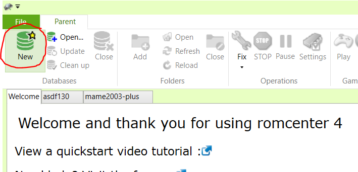
1. Select 'Get data from...', and open the .dat file.
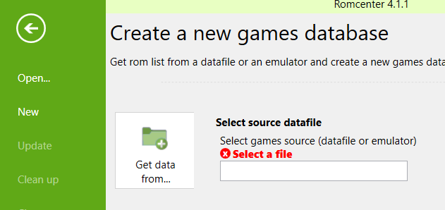
1. From the 'Advanced settings' window, select the 'Un-merged' option wherever available.
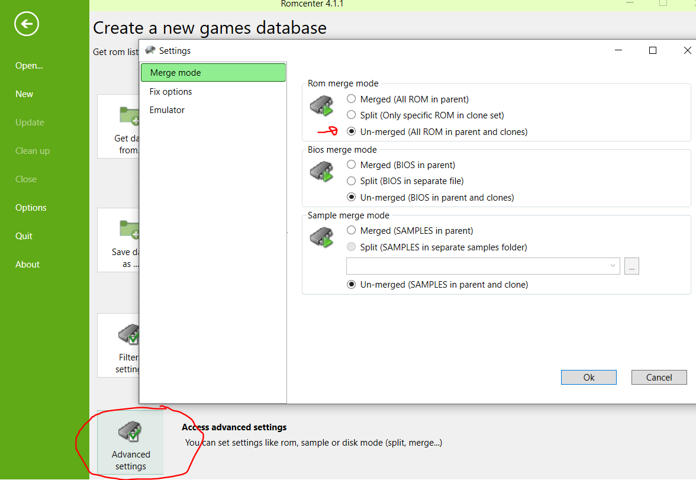
1. Select 'Create the database'. Once the database has been generated, drag the folder containing your roms into the RomCenter window.

Some of the games will be immediately playable (shown in green), others will first require automated fixes (yellow) and others yet, will not be playable at all. 

This can happen because files are missing from your roms (games shown in red), or simply because they are not supported by FBA4PSP (in grey).

# Using the emulator

## Directory structure

```
FBA4PSP/
├── CACHE/
│   └── [game snapshots/box art go here]
├── ROMS/
│   └── [zipped roms and configuration files]
├── EBOOT.PBP
├── exception.prx
├── fba4psp.ini
├── gamelist.txt
└── 说明Readme.txt
```

## Controls

R + Select = exits to menu (in-game).

L/R = next page (roms list).

## Screen modes

FBA4PSP supports nine different screen modes. 

The default screen mode can be changed by adding `screenMode 0x0` to the .ini configuration file, where the last digit is screen mode 1, 2, etc.

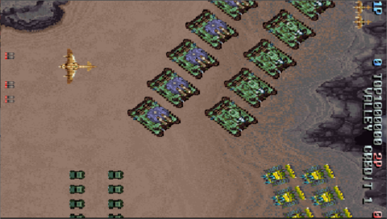

Screen Mode 0: 480x272.

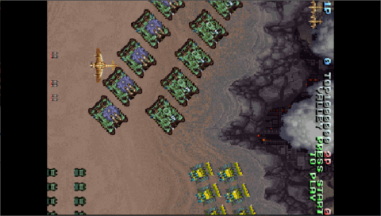

Screen Mode 1: 362x272.

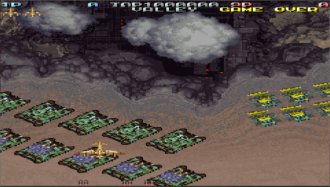

Screen Mode 2: 480x272.

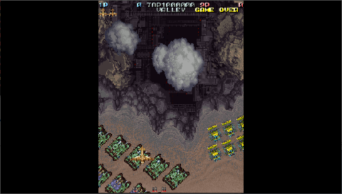

Screen Mode 3: 204x272.

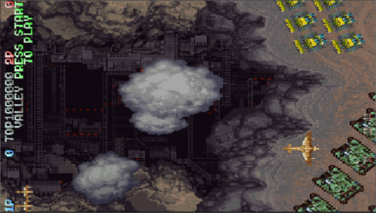

Screen Mode 4: 480x272.

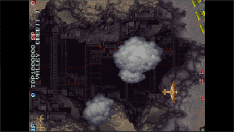

Screen Mode 5: 362x272.

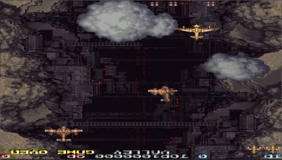

Screen Mode 6: 480x272.

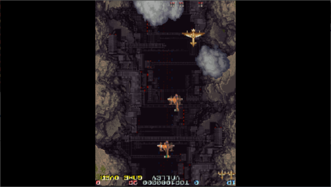

Screen Mode 7: 204x272.

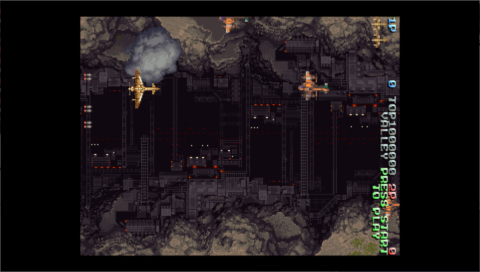

Screen Mode 8: 480x272.

## Preview images

PNG files located in a `CACHE` folder will be displayed alongside the list of games. The resolution should be 384x224. Snaps from [libretro-thumbnails](https://github.com/libretro-thumbnails) are included.

## Custom settings

Sometimes the ingame controls won't respond. This can be fixed by creating a .ini file with the Windows version of FinalBurn Alpha (tested with v0.2.96.86) and replacing the controls with the PSP equivalents.

The emulator looks for a configuration file named `romname.ini` within the `ROMS` folder. In other words, a game `1942.zip` will load a custom configuration file named `1942.ini`.

### Remapping buttons

Input buttons can be remapped in the configuration file:

```
input  "coin"          switch 0x0
```

| Button      | Code |
|-------------|------|
| Select      | 0x0  |
| Start       | 0x3  |
| D-pad Up    | 0x4  |
| D-pad Right | 0x5  |
| D-pad Down  | 0x6  |
| D-pad Left  | 0x7  |
| L trigger   | 0x8  |
| R trigger   | 0x9  |
| Triangle    | 0xC  |
| Circle      | 0xD  |
| Cross       | 0xE  |
| Square      | 0xF  |

The input buttons to be remapped include "coin", "start", "up", "right", "down", "left", "fire 1" , "fire 2" , "fire 3" , "fire 4" , "fire 5" , "fire 6".

### Other settings

By the same method, other settings such as "Region", "Dip A", "Dip B" can be remapped:

```
input  "Region"           constant 0x11
input  "Dip A"            constant 0x00
input  "Dip B"            constant 0x17
```

```
monoSound 0x1
gameSpeedCtrl 0x1
gameScreenWidth 480
gameScreenHeight 272
```
